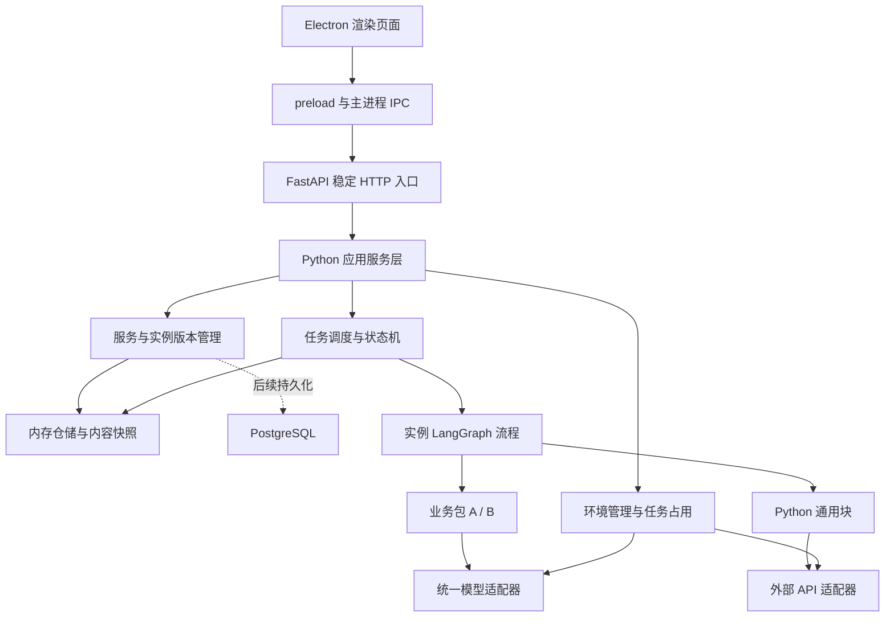
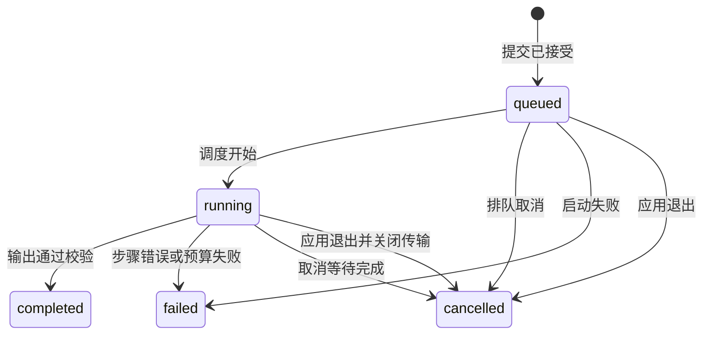

# Agent Platform 架构设计

- 版本：0.2
- 日期：2026-09-16
- 状态：设计基线；I1 工程与协议基础已实现，逐卡证据见 tasks/i1.md，其余能力仍为目标设计
- 需求依据：[产品需求 v0.4](product-requirements.md)
- 实施计划：[迭代开发文档](iteration-plan.md)

## 1. 设计目标与选择

首期交付桌面服务中心、标准模板和最小查重示例产品。服务中心组合一个或多个业务包及一个或多个配置，由实例拥有完整业务入口与流程，通过稳定 HTTP 入口接受调用。

已确认的产品规则：

- 包是可复用的 LLM 交互单元，包含模型调用前后的输入输出、Prompt 与必要处理。实例负责完整业务流程。
- 服务选择一个当前实例，旧实例不能直接接收新调用；回退在中心选择历史实例。
- 脚本、流程、包内容、配置和历史版本快照仅保存在内存，退出桌面程序即丢失。后续数据库版本才保留跨重启历史。
- 任务失败或取消保留终态，释放运行上下文，实例恢复就绪；不重试、不回滚已发生的外部操作。
- 引用某环境的任务尚未结束时禁止修改该环境；空闲时环境更新不改变实例版本。
- 一次包调用尝试计一轮 loop，开始后失败仍计数，重试另计。token 严格执行是可配置项。

技术栈由用户确定为 FastAPI + Pydantic + LangGraph + PostgreSQL，桌面端使用 Electron。标识格式、预算合并及查重细则是本稿的设计选择，可依据验证结果调整；调整不得改变上述产品语义或擅自替换指定技术栈。PostgreSQL 是后续数据库版本的持久化实现，首期仍使用内存，不因技术选型扩大跨重启保存范围。

## 2. 运行形态与技术方案

### 2.1 首期选型

| 层 | 设计选择 | 作用 |
| --- | --- | --- |
| 桌面界面 | Electron + HTML/CSS/JavaScript | 快速实现服务中心、环境配置、历史版本与任务详情；首期使用简单页面和表单 |
| 平台与包运行时 | Python | 承载 FastAPI、LangGraph、业务包与通用流程块 |
| HTTP API | FastAPI + Uvicorn，单进程内单服务循环 | 稳定调用入口、配置管理和任务查询 |
| 契约 | Pydantic 模型，严格校验，禁止未知字段 | 从模型导出 JSON Schema，复用为运行时校验来源 |
| 流程编排 | LangGraph StateGraph | 实例拥有图定义，平台包装节点校验、预算检查和取消边界 |
| 调度 | asyncio 队列和任务注册表 | 调度 LangGraph 执行，维护任务终态和退出清理 |
| 首期存储 | 内存仓储与不可变内容快照 | 实例、环境、任务及报告同次运行内可用 |
| 数据库 | PostgreSQL | 后续版本实现持久化和历史恢复；首期不要求数据库运行 |
| 模型与 API | 异步适配器 | 统一超时、预算、响应校验和连接关闭 |

Electron 主进程管理窗口及 Python 后端子进程，渲染进程负责简单表单；通过 preload 暴露有限 IPC 方法，不向页面开放任意 Node.js 调用。首期采用原生 HTML/CSS/JavaScript，不额外引入大型前端框架。[Electron 进程模型](https://www.electronjs.org/docs/latest/tutorial/process-model)

LangGraph 通过状态、节点与边表达实例流程，图编译后执行；平台仍显式校验节点输入输出，图结构检查不替代业务契约校验。[LangGraph Graph API](https://docs.langchain.com/oss/python/langgraph/graph-api)

PostgreSQL 已确定为关系数据库选型，后续通过仓储适配器接入；具体表结构和迁移在数据库迭代落地。[PostgreSQL 官方文档](https://www.postgresql.org/docs/current/tutorial.html)

Pydantic 提供严格模式，但仍需显式配置未知字段规则及嵌套约束；不能把开启严格模式当作全部边界校验已完成。[Pydantic 严格模式](https://docs.pydantic.dev/latest/concepts/strict_mode/)

服务启动、任务队列和连接释放统一纳入生命周期管理；FastAPI lifespan 用作 API 层生命周期入口。[FastAPI 生命周期](https://fastapi.tiangolo.com/advanced/events/)

依赖精确版本在工程初始化并检查兼容性后写入锁文件，不在本稿虚构已验证版本。当前开发工作区用于首轮源码运行验证，不承诺多操作系统安装包交付；依赖安装与构建发布仍遵循协作约定。

### 2.2 进程与通信

Electron 主进程启动并管理一个 Python 后端子进程。后端运行单个 Uvicorn worker 和 asyncio 事件循环，承载 FastAPI、仓储、任务队列、LangGraph 执行及异步 I/O。后端通过父子进程控制管道通知实际监听地址；健康检查就绪后页面才开放操作，启动失败显示原因。

渲染进程通过 contextBridge/preload 调用有限 IPC 接口，主进程将业务请求转为本地 FastAPI HTTP 请求；外部业务系统调用同一 HTTP API。渲染页面不保存任务权威状态，不直接操作 Python 仓储或 PostgreSQL。页面刷新不重启后端；首期最后一个主窗口关闭即退出应用，不保留托盘常驻。

首期默认全局单任务执行，其余排队；可保留并发参数但不以并行能力作为首期交付。同步计算采用有界小步骤，步骤之间检查终止信号；受信任包不得在事件循环内执行不可中断的长耗时工作。

HTTP 默认监听 `127.0.0.1`，桌面显示实际地址和端口；需要局域网调用时通过启动配置指定监听地址。首期不增加权限服务。桌面退出时停止 HTTP 服务，不保留后台常驻进程；禁止多 worker，避免内存记录分裂。



## 3. 模块责任

| 模块 | 负责 | 不负责 |
| --- | --- | --- |
| desktop | Electron 页面、preload/IPC、后端进程管理和退出事件 | 业务执行、直接读写仓储或数据库 |
| application | 保存配置、激活版本、提交／取消任务的原子操作 | 查重业务规则 |
| registry | 加载本地包、通用块及实例定义，校验依赖 | 自动下载安装包 |
| contracts | 严格模型、Schema 导出、字段错误归一化 | 静默填补模型输出 |
| versions | 内容快照、版本分类、当前实例指针 | 历史数据库持久化 |
| runtime | 任务状态、LangGraph 节点包装、流程上下文、包调用入口、预算 | 自主生成或自动修改业务流程 |
| adapters | 模型、API、传输中止、用量计量 | 业务最终判定 |
| repositories | 内存仓储与后续 PostgreSQL 适配接口 | 首期启用持久化或自动恢复任务 |
| samples | 包、实例脚本与流程、业务契约及样例 | 平台核心特定业务分支 |

## 4. 核心模型与标识

| 模型 | 关键字段 | 约束 |
| --- | --- | --- |
| Service | serviceId、name、activeInstanceId | serviceId 是同次运行内的稳定调用标识 |
| InstanceSnapshot | instanceId、serviceId、revision、changeKind、entry、workflow、packageRefs、configRefs、environmentRefs、contractRefs、contentDigest | 入口、流程、包和配置不可变；至少一个包和一个配置 |
| PackageArtifact | packageId、version、digest、files、entry、contractRefs、runtimeRequirements | 内容保存在内存，不能只指向可变源文件 |
| ConfigurationSnapshot | configId、revision、scope、values | 按作用域绑定包或实例，不依赖不明确的平铺覆盖顺序 |
| Environment | environmentId、revision、connections、credentialRefs、activeRunIds | revision 用于运行记录，不计入实例版本 |
| Run | runId、serviceId、instanceId、environmentSnapshot、input、status、cancelRequested、usage、result、error | 任务始终绑定接受提交时的实例及环境 |
| StepRecord | runId、stepId、packageBindingId、attempt、status、usage、error | 表示一次具体步骤／调用尝试 |

当前／退役由 Service 指针决定，不作为不可变快照内部可改字段。运行就绪／忙碌由未结束任务计算，与当前／退役相互独立。旧任务结束不能使退役实例重新成为当前实例。

多个配置使用命名作用域，例如 `instance`、`packages.semantic`、`packages.summary`。同作用域同字段重复定义时报冲突，页面显示冲突路径；通用默认值仅用于用户填写配置，不用于补齐不合规业务输入或模型输出。

版本设计采用递增 `revision` 作为唯一修订顺序，另以 `major.minor` 展示：

- 首版 `1.0`；包集合或内容、入口脚本、流程、服务契约变更：major 加一、minor 清零。
- 仅服务配置变更：minor 加一。
- 包与配置同时变更：major 加一，`changeKind=breaking`。
- 环境更新：仅 Environment.revision 变化；实例版本不变。
- 回退：指向原 instanceId 和版本，不生成假新版本。回退后再编辑，从该服务已分配的版本序列继续递增，不重用版本号。

## 5. 包协议、实例流程与契约

### 5.1 业务包

包必须声明版本、包入口、输入输出模型、配置模型、所需能力、预算字段及兼容运行时。包入口负责一次模型交互单元的输入准备、Prompt 构造、平台模型调用和输出结构化；不调度其他业务包，不拥有完整业务流程。

概念签名（不是已实现代码）：

```python
async def invoke(input: PackageInput, config: PackageConfig,
                 context: PackageContext) -> PackageOutput: ...
```

PackageContext 提供 `call_model`、`call_capability`、`record_progress`，不开放直接修改任务状态和最终结果的能力。实例统一通过平台 `invoke_package(binding_id, input)` 调用包，计数与校验不能由包自行绕过。复杂多模型业务拆成多个包调用；首期包内部不隐藏无限循环或自动重试。

### 5.2 实例定义

实例声明服务输入输出模型、入口脚本、流程、包绑定表、配置列表、环境引用和预算策略。首期流程是受信任 Python 脚本声明的 LangGraph StateGraph；节点表示业务步骤，边表示顺序或条件分支。图定义、节点脚本及配置归实例快照，不实现通用画布、动态 DSL 编译器或任意映射表达式编辑器。

实例上下文提供：

| 方法 | 语义 |
| --- | --- |
| invoke_package(binding_id, input) | 检查状态和预算、登记 loop、调用包、校验输出 |
| call_block(binding_id, input) | 调用注册 Python 通用块并校验输入输出 |
| call_api(binding_id, input) | 通过绑定访问 API、校验响应及明确返回上游错误 |
| run_step(step_id, operation) | 将确定性业务步骤纳入状态检查与记录 |
| record_progress(step_id, message) | 记录必要进度，默认不写入完整业务文本 |

实例入口返回最终对象，平台统一校验后提交结果。流程不能直接写入 `completed` 或发布部分成功报告。

### 5.3 LangGraph 执行约束

- 每个实例快照编译并关联其图对象；各任务使用独立图状态和运行上下文，不能共享可变业务数据。首期流程顺序执行，不引入并行分支和多 Agent 框架。
- 图状态结构由 Pydantic 契约定义；节点包装器在输入和状态更新边界显式校验。凭据、连接对象和取消信号保存在平台上下文，不放入可展示的图状态。
- 每个节点开始前及状态更新提交前检查预算与取消；进入下一条边、提交最终输出前也经过平台检查。业务包通过 invoke_package 计 loop，普通节点和图 super-step 不计业务 loop。
- LangGraph recursion_limit 只是图执行步数保护，不能直接设为包调用 loopLimit；按流程需要单独设置，触发时报告图执行限制错误，不伪装成包预算耗尽。
- 主动取消使用平台协作标记，等待在途 LLM 正常结束；不使用图 interrupt/resume 机制替代任务取消。退出桌面程序则中止本地传输与图执行。
- 首期不配置持久化 checkpointer，不启用自动重试、节点结果缓存或失败恢复；任务历史由内存仓储维护。后续 PostgreSQL 保存实例历史与 LangGraph 断点恢复是两项独立设计，不自动同时开启。
- 图异常上交任务状态机，终态由平台提交。图状态丢弃不代表撤销外部操作，LangGraph 不承担外部事务回滚。

### 5.4 单一契约来源

Python 契约模型是权威来源，导出 JSON Schema 供页面和调用方使用，清单引用模型而不手写第二份 Schema。配置页支持对象、数组、基础类型、枚举、必填、默认值与嵌套路径；复杂嵌套可使用校验后的 JSON 编辑区域，首期不承诺所有 Schema 特性都有专用控件。

所有用户输入、包／通用块输入输出、API 响应、模型结构化结果、实例最终结果均运行时校验。未知字段默认拒绝，禁止把字符串数字自动转成数值；模型返回无法解析的 JSON 直接失败，无自动修复。配置默认值显式呈现在表单，保存时形成完整配置。

加载阶段检查流程包绑定、必需配置和能力输入输出是否兼容；运行时再检查实际数据。固定 LMS 解包块以 `code == "10000"` 为成功，其余保留可用的 `code/msg/subCode/subMsg`；`bizData` 按绑定目标契约校验，不固定成字符串。

## 6. 保存、快照与回退

### 6.1 保存激活

1. 读取并验证实例定义、包、配置与流程依赖。
2. 在内存构造完整不可变快照，保存脚本源码字节、资源、Prompt、契约、包内容和所引用通用块版本。共享内容可按摘要复用，不能共享可变对象。
3. 校验当前环境引用及配置有效性，分配新版本。
4. 原子保存快照并切换 activeInstanceId；失败则保留旧指针，不能出现半生效实例。
5. 旧实例退役，已有任务继续使用自己的快照，新提交只接受当前实例。

从首次挂载就固定内容，退役时保留该内容，不能等退役后再从已经改动的源目录重新复制。平台运行时及已安装第三方依赖按应用会话锁定；包清单记录这些运行要求，首期不支持会话内升级宿主依赖。快照不包含远端模型、API 或凭据实体。

Python 自有源码按内容摘要建立独立模块命名空间，从内存内容加载，并保留已加载对象供旧任务使用；不得覆盖同名模块导致旧实例实际执行新代码。包资源经上下文读取内存快照，首期模板不依赖源文件绝对路径。该加载方式属于受信任代码管理，不是沙箱。

### 6.2 历史回退

用户在中心选定历史实例，平台验证快照完整性和当前环境兼容性后原子切换服务指针。历史配置中的环境引用仍使用当前环境连接；不恢复历史密钥或 LLM 地址。验证失败明确报错且不切换。

服务更新或回退可以在任务运行期间发生，既有任务仍完成旧快照；环境在占用期间禁止修改。历史数据仅在本次运行有效；退出时释放，重启后需重新挂载和配置，不出现虚假的历史恢复。

## 7. 环境一致性

提交任务、登记环境占用、环境更新在同一个应用服务临界区中协调：

1. 提交时解析当前实例，校验输入及必需环境；固定环境设置并登记所有引用环境的 runId，再将任务入队。
2. 从 `queued` 起即占用环境；`running` 及取消等待期间继续占用。
3. 更新环境时若 activeRunIds 非空，返回 `ENVIRONMENT_IN_USE`，包括阻塞运行标识；不得静默排队后自动修改。
4. 任务终态清理释放占用，空闲环境可原子更新，后续任务使用新配置。

锁定范围为被任务引用的环境，无关环境仍可编辑。更换凭据、模型标识、URL、超时等均视为环境修改；页面可以编辑草稿，但占用期间不能提交生效。运行记录保留非敏感环境快照，用于解释同一实例在环境变化前后的差异。

## 8. 状态机、取消与退出

### 8.1 任务状态



取消等待用 `status=running` 加 `cancelRequested=true`、`cancelPhase=waiting_transport` 表示，不混淆受理与完成。每次流程状态流转前，执行统一检查，记录预算、取消与错误；错误和取消终止路径始终允许清理。

### 8.2 事件优先级

| 情况 | 行为 |
| --- | --- |
| 排队取消 | 原子阻止调度，记 cancelled，释放环境 |
| 正在等待 LLM | 标记取消，禁止后续步骤；保持当前传输直至返回、超时或失败 |
| 等待期间超时／传输失败 | failed，错误为具体超时／传输原因，保留取消标记 |
| 当前 LLM 正常传输结束且请求了取消 | cancelled，不再校验业务输出或发布 completed |
| 取消与完成竞争 | 以终态提交临界区为准；先受理的取消阻止完成，已提交终态不再更改 |
| 非 LLM 步骤中取消 | 在步骤安全边界停止；可中止在途 API 传输，但不承诺撤销远端操作 |
| 退出桌面程序 | 先停止受理，再立即中止本地传输，停止队列与执行任务，释放运行资源 |

退出由桌面主生命周期触发，不能只靠 HTTP 服务的默认优雅退出等待。Electron 主进程通过独立父子进程控制管道发送退出信号；后端立即关闭模型/API 连接并中止图执行、停止受理，再退出事件循环。主进程只给本地清理短暂且有界的等待，超时终止后端子进程；控制管道断开也触发后端退出，避免父进程消失后残留服务。不等待 LLM 正常返回，不保证供应商停止计算或计费。中止原因使用 `APPLICATION_EXIT`，内存记录随后销毁，重启查询返回不存在。

取消、失败均保留原任务终态和必要错误，清理临时上下文但保留需求要求的任务输入和审计记录。实例若仍为当前且无其他任务则恢复就绪；退役身份不变。平台无自动重试、任务恢复或外部事务补偿。

## 9. loop 与 token 预算

### 9.1 配置组合

每个包的配置 Schema 必须暴露正整数 `loopLimit`、`tokenLimit`，模板给出可编辑默认值。它们表示该包绑定在单任务内允许累计使用的上限。实例配置另包含单任务全局 `loopLimit`、`tokenLimit`、`strictTokenLimit`，界面展示局部与全局约束。

首期全局默认值取所有包绑定配置上限之和，并在表单中显式展示后保存；用户可改小或改大。执行时同时满足单包绑定限额和全局限额，不依赖隐式配置覆盖。相同包绑定多次时按 bindingId 分别计局部账，全局仍累计全部调用。默认 `strictTokenLimit=true`，可在实例配置切换为非严格；改变预算是配置版本更新。

### 9.2 loop 边界

- 在业务包调用尝试开始前检查剩余额度，通过后原子增加局部及全局 loopsUsed，再校验包调用输入并执行。
- 已登记尝试的输入错误、执行错误、超时、输出错误都消耗一轮；被预算或取消检查提前拦截、尚未开始的调用不消耗。
- 重试再次经过同一入口并重新计数，首期平台不自动触发重试。
- 通用块、API、确定性计算和状态变更不计 loop；LLM 调用不能绕开业务包入口。
- `loopsUsed == loopLimit` 时仍允许最后一轮结束、结果校验和提交完成，只禁止发起下一轮。超限不允许新的业务工作。

### 9.3 token 模式

计量包含请求实际输入及输出；适配器须说明供应商用量字段、隐藏／推理 token 是否计入及可支持的上限保证。平台不把 token 上限表述为货币预算。

| 模式 | 请求前 | 请求后 | 无可靠计量时 |
| --- | --- | --- | --- |
| 严格 | 使用可证明的完整输入计量或保守上界，按局部和全局剩余量预留输入及输出额度；供应商必须支持对应输出上限 | 核销实际使用量，释放未使用预留；仍记录失败请求的已用量 | 无法保证时返回 `TOKEN_ACCOUNTING_UNSUPPORTED`，不静默降级 |
| 非严格 | 按已知／估算累计量检查并尽可能约束输出 | 允许单次请求导致超额；下一状态检查时报 `TOKEN_BUDGET_EXCEEDED`，不发布成功报告 | 使用适配器明确标注的估算，无法估算则报计量错误 |

每次任务和流程状态流转前检查；模型请求前再做额度预留，响应后核销，在包内部也不能绕过 token 限额。输入即已超过可用预算或无输出额度时不发送请求。

严格模式不是单纯在结束后比较数字。只有满足计量和输出约束能力的适配器才能支持它；供应商违背声明时记具体错误，不声称能追回已经消费的 token。超时无实际用量返回时，严格模式保守消耗该请求预留量并标注上界；非严格模式标明用量未知或估算，不计为零。

预算检查不覆盖已有的超时／传输错误，也不阻止失败、取消与退出清理。刚好用满额度且不再消费时允许正常结束；额度不足以开始下一操作时明确失败。

## 10. API 与错误契约

以下为目标协议，统一 `/api/v1` 前缀，尚未实现。JSON 字段使用 camelCase，内部 Python 字段可用 snake_case 并从契约统一导出别名。

| 方法与路径 | 语义 |
| --- | --- |
| GET /services | 稳定服务列表、当前 instanceId、版本与就绪／忙碌信息 |
| POST /services | 保存首个实例并创建服务 |
| POST /services/{serviceId}/versions | 保存完整新实例并切换入口 |
| GET /services/{serviceId}/versions | 当前会话内的历史列表 |
| POST /services/{serviceId}/activate | 指定历史 instanceId，校验后切换 |
| GET /services/{serviceId}/schema | 当前实例契约、版本、样例 |
| GET /environments、POST /environments | 环境列表与创建 |
| PUT /environments/{environmentId} | 空闲时更新，否则冲突 |
| POST /registry/load | 从受信任本地路径加载包、通用块或实例定义 |
| POST /runs | 提交 serviceId、input，可带 expectedInstanceId 以避免读取 Schema 后版本已变化 |
| GET /runs/{runId} | 状态、取消阶段、实际版本、预算使用与错误 |
| GET /runs/{runId}/result | 仅 completed 返回最终结果 |
| POST /runs/{runId}/cancel | 受理取消，响应明确当前是否已取消完成 |

POST /runs 在同一临界区解析当前版本、验证 expectedInstanceId、校验输入并固定快照。版本不符返回 409，输入不合规返回 422，未创建任务；被接受返回 202 和新 runId，不实现去重键。不得通过提交退役 instanceId 绕开服务入口。

任务尚未完成时结果接口返回 409 `RESULT_NOT_READY`；失败／取消返回 409 及对应终态和原因；记录不存在返回 404。重复取消终态任务返回其现有状态，不创建新任务、不覆盖错误。

统一错误对象：

```json
{
  "code": "MODEL_TIMEOUT",
  "stage": "packages.semantic.model",
  "message": "模型请求超时",
  "runId": "run_example",
  "fieldPath": null,
  "details": {"timeoutSeconds": 60}
}
```

错误类别至少包含配置、契约、依赖、环境占用、预算、模型/API 超时及传输失败、输出校验、记录不存在、版本冲突。details 仅允许脱敏字段，不直接透传上游凭据、请求头或完整响应。

## 11. 页面设计

### 11.1 服务中心／服务配置页

左侧服务列表；主区显示稳定地址、当前版本、包与配置绑定、实例入口和流程摘要。操作包括加载本地定义、编辑配置、校验保存、查看历史和选择回退。

预算区域分别显示每个包绑定的 loop/token 上限和任务总上限、严格模式。历史区域展示变更类别、包列表、配置及流程摘要，明确退役版本须先回退才能调用。任务详情作为附属面板，支持输入样例调用、状态／错误／用量查看、取消与最终报告展示，不另建教师业务系统。

### 11.2 环境配置页

配置模型地址、协议适配器、模型标识、凭据引用、API 连接、超时。凭据输入掩码显示；内存凭据仓储与普通配置分开，返回配置时不返回密钥原文。

有任务占用时显示阻塞任务列表并禁止保存；后端仍需同样校验，不能只靠禁用按钮。环境更新明确显示不产生实例新版本。程序重启后环境与凭据需重新配置，首期不实现本地密钥持久化。

## 12. 最小查重产品设计

此节是用户授权的简单业务方案，不新增平台能力。示例产品包含语义包和完整实例流程，确定性相似度计算位于实例业务模块。

### 12.1 输入与清洗

`targetText` 为字符串，`comparisonTexts` 为非空字符串数组；未知字段拒绝。目标或任一对照经清洗后为空时，按字段路径拒绝，不默默跳过。首期不以 1500 字或 6 篇作为硬性上限，超出模型能力时明确报错。

统一换行为 `\n`，按非空行视为段落；段落做 Unicode NFC、去首尾空白、连续水平空白折叠为一个空格。保留标点和大小写，不进行语义改写、分词或复杂近似匹配。清洗规则标识 `paragraph-exact-v1`。

### 12.2 确定性定量报告

对每个对照文本，目标段落清洗后与任一对照段落完全一致即匹配。每个目标段落出现位置最多计一次；对照文本重复同一段落不会额外放大计分。目标自身重复段落按实际出现位置计入。

`similarity = matchedTargetCharacters / totalTargetCharacters`，范围 `[0, 1]`；字符数按 Python Unicode 码点数计算，段落分隔换行不计入。返回分子、分母和方法标识，避免将数字误读为抄袭概率。展示百分比可四舍五入，契约保留原始比例。

每项最小字段：comparisonIndex、similarity、matchedTargetCharacters、totalTargetCharacters、matches；matches 提供 targetParagraphIndex 和 comparisonParagraphIndices，索引均从 0 开始，不默认复制全部原文。公共 method 字段为 `paragraph-exact-v1`。

例：目标为“甲乙\n丙丁”，对照仅含“甲乙”，得分为 2/4；对照重复两次“甲乙”仍为 2/4。

### 12.3 定性报告与流程

实例流程：校验输入 → 清洗 → 定量计算 → 调用 semantic 包 → 校验与组装最终报告。首期将所有对照一次送入语义包，一次调用消耗一轮；默认模板预算可配置，样例配置 loopLimit=1、tokenLimit=32768、strictTokenLimit=true，实际可用性取决于模型上下文与计量适配器。

语义包返回 `items`，每项包含 comparisonIndex、relation（`similar`／`possible_paraphrase`／`no_clear_relation`）、reason、suggestion。程序检查索引范围、唯一性及覆盖全部对照；不验收这些语义判断是否准确。

实例最终输出 quantitative（method、items）和 qualitative（items），两者缺一不可；不输出最终抄袭布尔值。模型失败时保留步骤错误，不把已完成的定量部分作为成功结果。

## 13. 目录与后续扩展

```text
desktop/
  main/                         # Electron 窗口、IPC 和后端子进程
  preload/                      # 有限页面桥接
  renderer/                     # HTML/CSS/JavaScript 表单
src/agent_platform/
  application/
  contracts/
  registry/
  versions/
  runtime/                      # LangGraph 节点包装、调度与预算
  adapters/
  repositories/
  blocks/
samples/
  template/
    packages/example/
    instance/
  assignment-similarity/
    packages/semantic/
    instance/
    examples/
tests/
  contracts/
  lifecycle/
  integration/
```

上述目录为整体规划；I1 已实现部分见 readme.md，后续随迭代创建实际文件，不创建占位空目录。仓储接口隔离内存实现，后续 PostgreSQL 数据库版本再处理版本内容持久化、迁移、恢复及凭据存储策略；不提前实现数据库直连、权限、复杂重试、沙箱或可视化画布。

首期主要技术验证点是内存代码快照隔离、退出传输中止、严格 token 计量、LangGraph 状态流转检查与 Electron/Python 子进程生命周期。对应验证排在早期迭代；技术验证不通过时调整适配器或宿主实现，并同步本稿，不以降低已确认语义代替完成。
