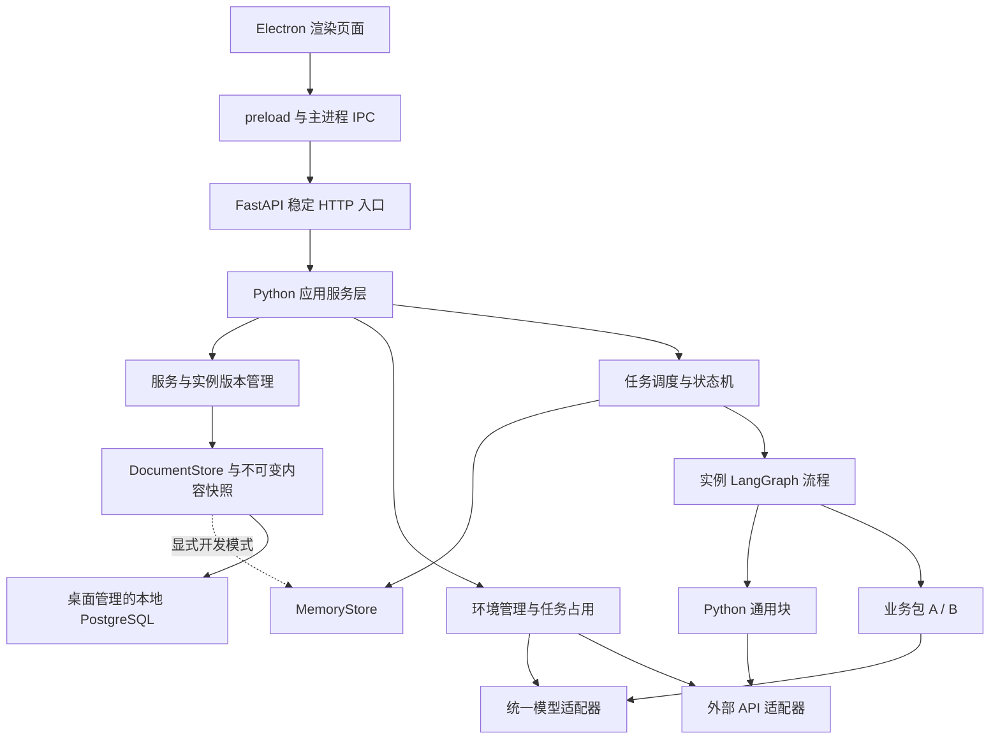
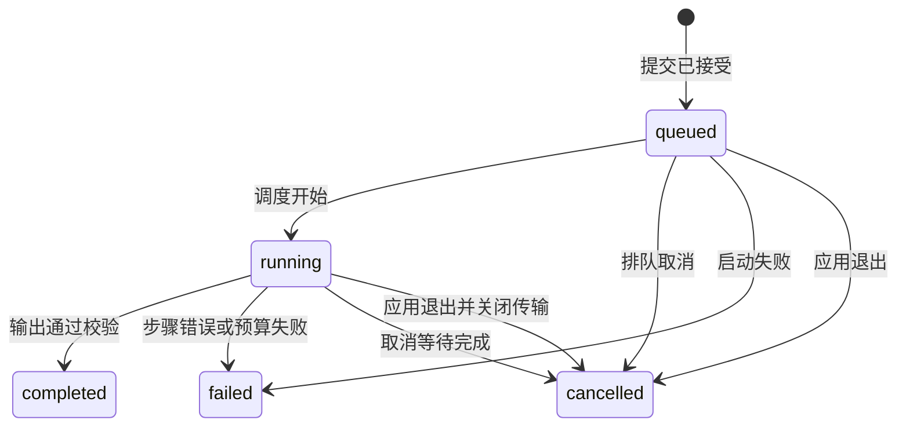

# Agent Platform 当前架构

更新日期：2026-09-18。本页保留当前运行结构和实现约束；产品范围见 [当前需求](product-requirements.md)，开发优先级见 [产品细化计划](product-refinement.md)。旧设计、查重算法和迁移记录见 [归档原文](archive/2026-09-18/architecture-design.md)。

## 1. 设计目标与选择

当前交付桌面服务中心与三类资源开发模板。服务配置页组合通用块、业务包与控制结构，配置并校验后生成完整实例；任务调用页通过稳定 HTTP 入口执行当前实例。

已确认的产品规则：

- 包是可复用的 LLM 交互单元，仅维护输入输出契约、可选参数与 Prompt，由平台执行模型调用。实例负责完整业务流程。
- 服务选择一个当前实例，旧实例不能直接接收新调用；回退在中心选择历史实例。
- 桌面自动管理本地 PostgreSQL，保存源码、配置、版本与运行记录；数据保留在应用专属目录，启动失败不降级为内存。
- 任务失败或取消保留终态，释放运行上下文，实例恢复就绪；不重试、不回滚已发生的外部操作。
- 引用某环境的任务尚未结束时禁止修改该环境；空闲时环境更新不改变实例版本。
- 一次包调用尝试计一轮 loop，开始后失败仍计数，重试另计。token 按供应商返回用量累计，响应后超额则失败。

技术栈由用户确定为 FastAPI + Pydantic + LangGraph + PostgreSQL，桌面端使用 Electron。标识格式与预算合并是本稿的设计选择，可依据验证结果调整；调整不得改变上述产品语义或擅自替换指定技术栈。桌面和独立 CLI 默认启动本地 PostgreSQL，开发用 --memory 才显式使用内存。持久化与恢复语义见 [接入说明](persistence.md)，不包含断点续跑。

## 2. 运行形态与技术方案

### 2.1 首期选型

| 层 | 设计选择 | 作用 |
| --- | --- | --- |
| 桌面界面 | Electron + HTML/CSS/JavaScript | 快速实现服务中心、环境配置、历史版本与任务详情；首期使用简单页面和表单 |
| 平台与包运行时 | Python | 承载 FastAPI、LangGraph、业务包与通用流程块 |
| HTTP API | FastAPI + Uvicorn，单进程内单服务循环 | 稳定调用入口、配置管理和任务查询 |
| 契约 | Pydantic 模型及严格标量适配，禁止未知字段 | 从模型导出 JSON Schema，复用为运行时校验来源 |
| 流程编排 | LangGraph StateGraph | 平台把已校验的服务拼图编译为实例图，包装节点校验、预算检查和取消边界 |
| 调度 | asyncio 队列和任务注册表 | 调度 LangGraph 执行，维护任务终态和退出清理 |
| 默认存储 | 应用专用 PostgreSQL 与不可变快照 | 桌面启动即持久化，连接和密钥由程序管理 |
| 开发存储 | MemoryStore | 仅显式 --memory 启用，退出清空 |
| 模型与 API | 异步适配器 | 统一超时、响应校验和连接关闭；模型调用另受 loop/token 预算约束 |

Electron 主进程管理窗口及 Python 后端子进程，渲染进程负责简单表单；通过 preload 暴露有限 IPC 方法，不向页面开放任意 Node.js 调用。首期采用原生 HTML/CSS/JavaScript，不额外引入大型前端框架。[Electron 进程模型](https://www.electronjs.org/docs/latest/tutorial/process-model)

LangGraph 通过状态、节点与边表达实例流程，图编译后执行；平台仍显式校验节点输入输出，图结构检查不替代业务契约校验。[LangGraph Graph API](https://docs.langchain.com/oss/python/langgraph/graph-api)

PostgreSQL 通过文档仓储接口接入；使用格式版本表、JSONB 文档表、批次事务及单后端会话锁，详见 [持久化设计](persistence.md)。[PostgreSQL 官方文档](https://www.postgresql.org/docs/current/tutorial.html)

Pydantic 提供严格模式，但仍需显式配置未知字段规则及嵌套约束；不能把开启严格模式当作全部边界校验已完成。[Pydantic 严格模式](https://docs.pydantic.dev/latest/concepts/strict_mode/)

服务启动、任务队列和连接释放统一纳入生命周期管理；FastAPI lifespan 用作 API 层生命周期入口。[FastAPI 生命周期](https://fastapi.tiangolo.com/advanced/events/)

依赖版本以仓库锁文件为准；当前以源码运行，不承诺多操作系统安装包交付。依赖安装与构建发布遵循 [协作约定](../AGENT.md)。

### 2.2 进程与通信

Electron 主进程启动并管理一个 Python 后端子进程。后端运行单个 Uvicorn worker 和 asyncio 事件循环，承载 FastAPI、仓储、任务队列、LangGraph 执行及异步 I/O。后端通过父子进程控制管道通知实际监听地址；健康检查就绪后页面才开放操作，启动失败显示原因。

渲染进程通过 contextBridge/preload 调用有限 IPC 接口，主进程将业务请求转为本地 FastAPI HTTP 请求；外部业务系统调用同一 HTTP API。渲染页面不保存任务权威状态，不直接操作 Python 仓储或 PostgreSQL。页面刷新不重启后端；首期最后一个主窗口关闭即退出应用，不保留托盘常驻。

当前全局单任务执行，其余排队。通用块的同步计算应采用有界小步骤，步骤之间检查终止信号；长耗时同步块的隔离属于后续扩展。

HTTP 默认监听 `127.0.0.1`，桌面显示实际地址和端口；需要局域网调用时通过启动配置指定监听地址。首期不增加权限服务。桌面退出时停止 HTTP 服务，不保留后台常驻进程；禁止多 worker，避免内存记录分裂。



## 3. 模块责任

| 模块 | 负责 | 不负责 |
| --- | --- | --- |
| desktop | Electron 页面、preload/IPC、后端进程管理和退出事件 | 业务执行、直接读写仓储或数据库 |
| application | 保存配置、激活版本、提交／取消任务的原子操作 | 查重业务规则 |
| registry | 加载本地包、单文件通用块及契约资源，提供模块目录，校验代码依赖 | 自动下载安装包 |
| contracts | 严格模型、Schema 导出、字段错误归一化 | 静默填补模型输出 |
| versions | 内容快照、版本分类、当前实例指针 | 数据库驱动实现 |
| runtime | 任务状态、LangGraph 节点包装、流程上下文、包调用入口、预算 | 自主生成或自动修改业务流程 |
| adapters | 模型、API、传输中止、用量计量 | 业务最终判定 |
| repositories / storage | 领域仓储、事务文档存储、记录恢复 | 自动重跑任务、业务数据库接入 |
| samples | 包、单文件业务块、拼图样例、业务契约及样例 | 平台核心特定业务分支 |

## 4. 核心模型与标识

| 模型入口 | 职责 |
| --- | --- |
| [服务契约](../src/agent_platform/contracts/services.py) | 稳定服务、实例标识、版本与历史 |
| [流程契约](../src/agent_platform/contracts/flows.py)、[草稿契约](../src/agent_platform/contracts/drafts.py) | 节点、端口、控制结构和可编辑草稿 |
| [流程快照](../src/agent_platform/flows/snapshots.py) | FlowSnapshot、内容固定与实例准备 |
| [资源契约](../src/agent_platform/contracts/catalog.py)、[包契约](../src/agent_platform/contracts/packages.py) | 资源标识、清单、Prompt 与类型引用 |
| [环境契约](../src/agent_platform/contracts/environments.py) | 连接、凭据引用与环境版本 |
| [任务契约](../src/agent_platform/contracts/runs.py) | 任务状态、步骤、用量、结果与错误 |

字段以权威模型及其导出 Schema 为准，不在本文维护第二套字段清单。

当前／退役由 Service 指针决定，不作为不可变快照内部可改字段。运行就绪／忙碌由未结束任务计算，与当前／退役相互独立。旧任务结束不能使退役实例重新成为当前实例。

业务包按 nodeId 独立保存节点配置；同包放置多次也分别维护参数、模型连接与预算。通用默认值用于填写配置，不用于补齐不合规业务输入或模型输出。

版本设计采用递增 `revision` 作为唯一修订顺序，另以 `major.minor` 展示：

- 首版 `1.0`；包／块集合或内容、流程拓扑、端口连线、控制结构、服务契约变更：major 加一、minor 清零。
- 仅服务配置变更：minor 加一。
- 包／块内容或流程结构与节点配置同时变更：major 加一，`changeKind=breaking`。
- 环境更新：仅 Environment.revision 变化；实例版本不变。
- 回退：指向原 instanceId 和版本，不生成假新版本。回退后再编辑，从该服务已分配的版本序列继续递增，不重用版本号。

## 5. 包协议、实例流程与契约

### 5.1 业务包

2026-09-18 起，业务包仅声明身份/版本、输入输出契约、Prompt 和可选业务参数模型。平台提供统一执行入口，包不再维护 entry、runtimeRequirements、requiredCapabilities 或 PackageContext。

标准调用：严格校验输入及业务参数 → 读取快照 Prompt → 替换 {{input.field}} / {{parameters.field}} → 构造并校验 ModelRequest → 一次模型请求与计量 → 校验 ModelResponse → 严格校验业务输出。系统消息自动携带输出 JSON Schema，返回值为校验后的业务对象。错误不做自动修复或重试。

Prompt 不执行表达式或转换，只做命名字段替换；如何准备输入、清洗、查询、加工数据及组合结果都由通用块节点负责。嵌套对象字段可直接引用，对象/数组按 JSON 填入，插入内容不递归解析。

节点配置独立包含 parameters、model（environmentId/connectionId）、budget 和 maxOutputTokens。包可通过 budgetDefaults 提供节点初始化限额；预算不进入 Config，运行只读取固定节点和任务预算。无需自定义参数的包可省略 configuration 契约引用。

### 5.2 服务拼图生成实例

配置者从已加载模块目录放置节点，不预先加载完整实例或编写入口脚本。FlowDraft 记录输入／期望输出、流程结构、端口引用、包节点配置，以及 API 通用块的连接引用和请求路径。草稿可以不完整；后端提供校验结果，只有完成校验并成功保存才创建 FlowSnapshot 并切换稳定服务入口。

保存链路为：草稿 → 结构与契约检查 → 模块及环境检查 → 编译执行图 → 固定完整内容 → 原子保存版本。服务实例用于任务调用，不能将未完成草稿作为实例执行。当前唯一实例链路为 FlowDraft → prepare_flow_snapshot → compile_flow → RunWorker；不兼容旧手写实例入口。

包节点经平台 invoke_package(nodeId, input) 执行，通用块经独立 invoke_block(nodeId, input) 执行；通用块不再强制附属于某个包绑定。包不再调用 API 或块；相关数据处理在独立通用块节点中完成。

新流程协议是受限结构化描述，不执行用户在页面输入的 Python。顺序、if/else、repeat、while 是显式结构，禁止用任意回边暗示循环。服务输入、最终输出及节点输入均有契约；输出节点完成后由平台统一校验、提交结果。

### 5.3 LangGraph 执行约束

- 每个实例快照编译并关联其图对象；各任务使用独立图状态和运行上下文，不能共享可变业务数据。首期支持顺序、条件和循环，实际节点串行执行，不引入并行分支和多 Agent 框架。
- 图状态结构由 Pydantic 契约定义；节点包装器在输入和状态更新边界显式校验。凭据、连接对象和取消信号保存在平台上下文，不放入可展示的图状态。
- 每个节点开始前及状态更新提交前检查预算与取消；进入下一条边、提交最终输出前也经过平台检查。业务包通过 invoke_package 计 loop，普通节点和图 super-step 不计业务 loop。
- LangGraph recursion_limit 只是图执行步数保护，不能直接设为包调用 loopLimit；按流程需要单独设置，触发时报告图执行限制错误，不伪装成包预算耗尽。
- 主动取消使用平台协作标记，等待在途 LLM 正常结束；不使用图 interrupt/resume 机制替代任务取消。退出桌面程序则中止本地传输与图执行。
- 首期不配置持久化 checkpointer，不启用自动重试、节点结果缓存或失败恢复；任务历史按所选仓储维护。PostgreSQL 保存记录与 LangGraph 断点恢复是两项独立设计，不自动同时开启。
- 图异常上交任务状态机，终态由平台提交。图状态丢弃不代表撤销外部操作，LangGraph 不承担外部事务回滚。

### 5.4 单一契约来源

Python 契约模型／严格类型声明是权威来源，导出 JSON Schema 供页面和调用方使用，清单引用模型而不手写第二份 Schema。配置页支持对象、数组、基础类型、枚举、必填、默认值与嵌套路径；复杂嵌套可使用校验后的 JSON 编辑区域，首期不承诺所有 Schema 特性都有专用控件。

所有用户输入、包／通用块输入输出、API 响应、模型结构化结果、实例最终结果均运行时校验。未知字段默认拒绝，禁止把字符串数字自动转成数值；模型返回无法解析的 JSON 直接失败，无自动修复。配置默认值显式呈现在表单，保存时形成完整配置。

加载阶段检查模块源码、依赖与声明契约，不要求运行环境已绑定。节点配置阶段检查包的参数、预算和模型连接，或 API 块的连接及请求路径；保存阶段检查整个流程的端口及当前环境；运行时再检查实际数据。API 响应结构由通用块通过 response_type 指定并严格校验；平台不包含固定业务响应外壳。

### 5.5 流程结构、端口与数据作用域

本节是基于需求已确认决策的技术设计：结构化嵌套容器、显式携带值、前置条件循环、契约资源选择均为设计选择。最终字段由 [流程契约](../src/agent_platform/contracts/flows.py) 和导出 Schema 统一确定，文中示意不作为第二份手工 Schema。

- 每个业务模块有一个契约化输入值和输出值，页面展示对象字段与约束，但不能选取或拼装字段。输入绑定可引用服务输入、当前作用域前序节点输出、循环携带值；只支持完整值引用，每个输入必须有一个完整数据来源。
- 接线只传递完整数据并校验契约，不执行字段选取、改名、拼装、计算或类型转换；需要数据处理时必须插入通用块。输入常量只能通过其契约校验后使用，不能表达可执行代码。
- 仅允许引用控制流上保证先执行且在作用域内可用的输出；禁止前向引用、未执行分支引用、读取循环内尚未产生的结果。外部不可直接读取子作用域节点的临时输出。
- if/else 使用一个输出为严格 bool 的通用块计算条件，两个分支互斥执行；分支各声明输出并接入共同出口契约，需要转换时在分支内显式加块。未声明空分支输出时不能默认为空对象或透传。
- repeat 使用已校验的非负整数次数，while 使用布尔通用块作执行前判断并要求正整数 maxIterations。达到上限后仍需继续时以 LOOP_ITERATION_LIMIT 失败；条件已经为 false 时正常退出，不把上限当作成功条件。
- 循环显式声明携带值的初始输入、契约和每轮更新来源；本轮完成后更新，下一轮才可读取。循环体输出必须满足携带值契约；零次循环返回初始携带值。循环外只能读取循环出口，不隐式读取“最后一次节点输出”。
- 首期支持上述控制结构嵌套，仍按作用域串行执行；图步数限制与循环次数、业务包 loop 预算分别记录与报错。图步数不得沿用旧 node_count + 2 的顺序图上限。
- 期望输出由配置者选择已注册的契约资源，输入契约同理；可以复用模块输入输出契约，新增业务契约由开发者提供 Python 模型。首期不建设任意 Schema 设计器。最终输出绑定必须覆盖期望结构，并在保存及运行时分别校验。

契约连接采用保守的“出口可赋给入口”规则，而非只比较名称或直接比较整份 Schema 字符串：入口必填字段必须存在；出口类型、可空性、枚举和范围必须满足入口限制；入口禁止额外字段时整对象连接不得多传字段。对象字段和数组元素递归检查，引用先解析。无法静态证明兼容的特殊约束不能直接宣称兼容，应指出约束并要求明确的契约适配；Pydantic 自定义校验仍须运行时执行。

### 5.6 单文件通用块与模板

受信任的 `.py` 文件通过 `@block` 声明一个公开业务函数、标识、版本和说明，函数的业务输入及返回注解提供权威契约。API 块另声明关键字参数 api: BlockAPI，由平台注入绑定连接及节点请求路径的接口。环境保存 Base URL、凭据与超时，节点 api.path 保存必填的相对路径；块调用 api.request(method, payload, response_type=...)，平台从实例快照取路径并拼接请求地址。加载器检查签名、依赖与类型，固定源码内容，不通过执行业务函数确认加载成功。bool 等标量使用严格类型校验。

可运行代码见 [最小块](../samples/blocks/minimal.py) 与 [完整块](../samples/blocks/complete.py)，入口出口、输入选项和同步/异步函数约定见 [块开发说明](../samples/blocks/README.md)。业务包和独立契约模板统一从 [资源指导手册](resource-guide.md) 进入。

### 5.7 节点配置及可读错误

业务包源码加载成功只代表模块资源可用。包节点必须配置参数、预算、所需环境连接后才能标记合法。同一包放置两次，nodeId、参数、环境及预算完全独立；同一节点在循环中重复执行时累计同一份局部预算，不逐轮重置。

点击包节点打开悬浮窗，依配置 Schema 显示字段、说明、默认值、必填与嵌套错误；选择已保存环境中的模型连接。保存节点配置后重新校验节点，主流程保持草稿；保存服务版本另走全流程校验。通用块显示函数说明、输入输出和连线；声明 api=True 的块提供 API 连接选择和必填的请求路径输入框，无模型或预算选项。路径没有默认值，预检拒绝空路径、完整 URL、查询字符串、片段和目录回退。

错误扩展保留 code、stage、fieldPath，并增加可选 nodeId、sourceNodeId、sourcePort、targetPort 和结构化校验 issue（原因类型、可读原因、期望约束）。对 Pydantic 错误提取脱敏原因，不直接输出包含输入值的 repr、原始 ctx 或任意异常全文。页面定位节点／端口并在配置字段旁显示错误；运行失败保留尝试及循环路径。

## 6. 保存、快照与回退

### 6.1 保存激活

1. 读取服务草稿，验证所有节点、端口、作用域、最终输出、包配置及 API 块配置；不完整草稿不可发布为实例。
2. 编译结构化流程，在内存构造完整不可变快照，保存拼图、编译器版本、模块源码字节、资源、Prompt、契约、包内容和所引用通用块版本。共享内容可按摘要复用，不能共享可变对象。
3. 校验当前环境引用及配置有效性，分配新版本。
4. 原子保存快照并切换 activeInstanceId；失败则保留旧指针，不能出现半生效实例。
5. 旧实例退役，已有任务继续使用自己的快照，新提交只接受当前实例。

从首次挂载就固定内容，退役时保留该内容，不能等退役后再从已经改动的源目录重新复制。平台运行时及已安装第三方依赖按应用会话锁定；Prompt 包不声明运行依赖；通用块仍检查其依赖，首期不支持会话内升级宿主依赖。快照不包含远端模型、API 或凭据实体。

Python 自有源码按内容摘要建立独立模块命名空间，从内存内容加载，并保留已加载对象供旧任务使用；不得覆盖同名模块导致旧实例实际执行新代码。平台标准入口读取包 Prompt 的内存快照，首期模板不依赖源文件绝对路径。该加载方式属于受信任代码管理，不是沙箱。

### 6.2 历史回退

用户在中心选定历史实例，平台验证快照完整性和当前环境兼容性后原子切换服务指针。历史配置中的环境引用仍使用当前环境连接；API 请求路径恢复为历史节点的 api.path，不恢复历史环境的 Base URL 或凭据。验证失败明确报错且不切换。

服务更新或回退可以在任务运行期间发生，既有任务仍完成旧快照；环境在占用期间禁止修改。内存模式历史只在本次运行有效；PostgreSQL 模式从已保存源码重建历史，回退和调用仍检查当前环境。

## 7. 环境一致性

提交任务、登记环境占用、环境更新在同一个应用服务临界区中协调：

1. 提交时解析当前实例，校验输入及必需环境；固定环境设置并登记所有引用环境的 runId，再将任务入队。
2. 从 `queued` 起即占用环境；`running` 及取消等待期间继续占用。
3. 更新环境时若 activeRunIds 非空，返回 `ENVIRONMENT_IN_USE`，包括阻塞运行标识；不得静默排队后自动修改。
4. 任务终态清理释放占用，空闲环境可原子更新，后续任务使用新配置。

锁定范围为被任务引用的环境，无关环境仍可编辑。更换凭据、模型标识、URL、超时等均视为环境修改；页面可以编辑草稿，但占用期间不能提交生效。运行记录保留非敏感环境快照，用于解释同一实例在环境变化前后的差异。

## 8. 状态机、取消与退出

### 8.1 任务状态



取消等待用 `status=running` 加 `cancelRequested=true`、`cancelPhase=waiting_transport` 表示，不混淆受理与完成。每次流程状态流转前，执行统一检查，记录预算、取消与错误；错误和取消终止路径始终允许清理。

### 8.2 事件优先级

| 情况 | 行为 |
| --- | --- |
| 排队取消 | 原子阻止调度，记 cancelled，释放环境 |
| 正在等待 LLM | 标记取消，禁止后续步骤；保持当前传输直至返回、超时或失败 |
| 等待期间超时／传输失败 | failed，错误为具体超时／传输原因，保留取消标记 |
| 当前 LLM 正常传输结束且请求了取消 | cancelled，不再校验业务输出或发布 completed |
| 取消与完成竞争 | 以终态提交临界区为准；先受理的取消阻止完成，已提交终态不再更改 |
| 非 LLM 步骤中取消 | 在步骤安全边界停止；在途 API 请求等待返回、超时或失败后处理取消，不撤销远端操作；应用退出才立即中止本地传输 |
| 退出桌面程序 | 先停止受理，再立即中止本地传输，停止队列与执行任务，释放运行资源 |

退出由桌面主生命周期触发，不能只靠 HTTP 服务的默认优雅退出等待。Electron 主进程通过独立父子进程控制管道发送退出信号；后端立即关闭模型/API 连接并中止图执行、停止受理，再退出事件循环。主进程预留 20 秒清理任务、连接及停库，超时先发 SIGTERM，再等待 10 秒后终止后端子进程；控制管道断开也触发后端退出，避免父进程消失后残留服务。不等待 LLM 正常返回，不保证供应商停止计算或计费。正常退出原因使用 `APPLICATION_EXIT`；PostgreSQL 模式保留终态，强制退出遗留的未完成记录下次启动标记 `APPLICATION_INTERRUPTED`。

取消、失败均保留原任务终态和必要错误，清理临时上下文但保留需求要求的任务输入和审计记录。实例若仍为当前且无其他任务则恢复就绪；退役身份不变。平台无自动重试、任务恢复或外部事务补偿。

## 9. loop 与 token 预算

### 9.1 配置组合

包的业务参数 Schema 不包含平台预算。节点 budget 暴露正整数 `loopLimit`、`tokenLimit`，包可选 budgetDefaults 仅提供初始化默认值，未声明时使用平台默认 1/32768。节点显式配置覆盖包默认值，保存后固定为节点在单任务内允许累计使用的上限。含包实例配置另包含单任务全局 `loopLimit`、`tokenLimit`，界面展示局部与全局约束。

首期全局默认值取所有包节点配置上限之和，并在表单中显式展示后保存；用户可改小或改大。执行时同时满足节点限额和全局限额，不依赖隐式配置覆盖。相同包放置多次时按 nodeId 分别计局部账，全局仍累计全部调用。改变预算是配置版本更新。

纯通用块实例允许零个业务包，不创建虚拟包预算，不要求模型环境；仍执行节点契约、循环最大次数、图步数限制、取消与退出检查。

### 9.2 loop 边界

- 在业务包调用尝试开始前检查剩余额度，通过后原子增加局部及全局 loopsUsed，再校验包调用输入并执行。
- 已登记尝试的输入错误、执行错误、超时、输出错误都消耗一轮；被预算或取消检查提前拦截、尚未开始的调用不消耗。
- 重试再次经过同一入口并重新计数，首期平台不自动触发重试。
- 通用块、API、确定性计算和状态变更不计 loop；LLM 调用不能绕开业务包入口。
- `loopsUsed == loopLimit` 时仍允许最后一轮结束、结果校验和提交完成，只禁止发起下一轮。超限不允许新的业务工作。

### 9.3 token 计量

模型统一使用 OpenAI 兼容 Chat Completions。按响应中的输入/输出 token 累计到节点与任务；exact 表示采用供应商报告计数，不代表验证了实际计费。

请求前检查累计额度，并按剩余额度收紧 maxOutputTokens。平台不做输入 token 预估或严格上界预留，因此单次请求可能超过剩余总额度；响应后的状态检查报 TOKEN_BUDGET_EXCEEDED，不发布成功结果。缺少 usage 时明确报 TOKEN_ACCOUNTING_UNSUPPORTED，不估算、不记为零。

失败响应若携带合法用量仍记账；超时或断连无用量时标记未知，保留原传输错误。预算检查不覆盖已有错误，不阻止取消、失败及退出清理。刚好用满额度且不再调用模型时允许正常结束。

## 10. API 与错误契约

统一 `/api/v1` 前缀；服务保存接收完整拼图及配置并返回生成实例，资源入口统一为 catalog。下表是当前接口；完整请求与响应以运行中的 /docs 为准。JSON 字段使用 camelCase，内部 Python 字段可用 snake_case 并从契约统一导出别名。

| 方法与路径 | 语义 |
| --- | --- |
| GET /services | 稳定服务列表、当前 instanceId、版本与就绪／忙碌信息 |
| POST /services | 保存首个实例并创建服务 |
| POST /services/{serviceId}/versions | 保存完整新实例并切换入口 |
| GET /services/{serviceId}/versions | 实例历史列表 |
| POST /services/{serviceId}/activate | 指定历史 instanceId，校验后切换 |
| GET /services/{serviceId}/schema | 当前实例契约、版本、样例 |
| GET /environments、POST /environments | 环境列表与创建 |
| PUT /environments/{environmentId} | 空闲时更新，否则冲突 |
| POST /catalog/load | 加载业务包目录、通用块 .py 文件或契约资源；不要求先绑定环境 |
| GET /catalog；GET /catalog/{resourceId} | 返回资源标识、版本、端口及配置 Schema |
| POST /flows/validate | 校验草稿结构、接线、节点配置及期望输出，返回定位信息；不创建实例 |
| GET/POST /drafts；GET/PUT /drafts/{draftId} | 草稿读取与保存，不激活服务、不进入实例历史 |
| POST /runs | 提交 serviceId、input，可带 expectedInstanceId 以避免读取 Schema 后版本已变化 |
| GET /runs/{runId} | 状态、取消阶段、实际版本、预算使用与错误 |
| GET /runs/{runId}/result | 仅 completed 返回最终结果 |
| POST /runs/{runId}/cancel | 受理取消，响应明确当前是否已取消完成 |

POST /runs 在同一临界区解析当前版本、验证 expectedInstanceId、校验输入并固定快照。版本不符返回 409，输入不合规返回 422，未创建任务；被接受返回 202 和新 runId，不实现去重键。不得通过提交退役 instanceId 绕开服务入口。

任务尚未完成时结果接口返回 409 `RESULT_NOT_READY`；失败／取消返回 409 及对应终态和原因；记录不存在返回 404。重复取消终态任务返回其现有状态，不创建新任务、不覆盖错误。

统一错误对象：

```json
{
  "code": "MODEL_TIMEOUT",
  "stage": "packages.semantic.model",
  "message": "模型请求超时",
  "runId": "run_example",
  "fieldPath": null,
  "details": {"timeoutSeconds": 60}
}
```

错误类别至少包含配置、契约、依赖、环境占用、预算、模型/API 超时及传输失败、输出校验、记录不存在、版本冲突。details 仅允许脱敏字段，不直接透传上游凭据、请求头或完整响应。

## 11. 页面设计

### 11.1 服务中心／服务配置页

左侧服务及模块列表；主区为自上而下的拼图区域，if/else 和循环以可嵌套容器呈现。节点展示输入／输出端口及合法状态，支持插入、移动、删除和显式连线；连接只在契约兼容时成立，错误在相应节点与端口显示。页面支持引用作用域内前序输出，不要求手写完整 JSON。

点击业务包弹出悬浮窗配置参数、预算及环境连接；普通嵌套参数可以使用按字段定位的 JSON 编辑区，但不可用整份实例 JSON 替代拼图或能力选择。通用块展示说明与契约；API 块另配置连接引用和请求路径。条件／循环容器展示条件块、分支输出、次数及携带值配置。

服务页分开“保存草稿”和“校验并保存实例版本”；后者成功立即生效。历史展示完整只读拼图、节点参数、预算、API 请求路径、环境引用和变更类别，支持复制到编辑草稿及回退。回退不恢复旧环境地址或密钥。

任务调用页独立展示可调用服务及当前实例版本、输入样例、运行状态、节点与循环尝试、预算、取消及最终结果。只能调用已完成实例；不在任务页拼图或配置包，不增加教师复核系统。

### 11.2 环境配置页

分别配置模型与 API 连接：模型使用 OpenAI 兼容协议，API 连接供块绑定；两者支持地址、凭据引用及超时。凭据输入掩码显示；凭据仓储与普通配置分开，持久化模式仅保存密文，返回配置时不返回密钥原文。

有任务占用时显示阻塞任务列表并禁止保存；后端仍需同样校验，不能只靠禁用按钮。环境更新明确显示不产生实例新版本。内存模式重启需重新配置；桌面通过用户专属 secrets.json 解密恢复凭据，主密钥不落平台数据库。

## 12. 扩展边界

当前采用模块化单体：资源目录、流程、运行时、适配器与文档仓储分工。保持单 API 进程与单 worker；内存队列、环境占用锁及快照对象尚不能直接跨进程共享，不通过增加 Uvicorn workers 扩容。

| 阶段 | 应先明确的接口与边界 |
| --- | --- |
| R1 配置体验 | 按资源、接线、节点配置和控制容器拆分前端模块，保持同一草稿状态来源 |
| R2 版本与导入导出 | 资源引用关系、快照投影和可重建的源码/依赖格式，不能只导出路径或 resourceId |
| R3 持久化 | 仓储接口、PostgreSQL 迁移、原子版本切换、凭据存储和记录清理；持久化不自动意味着任务断点恢复 |
| R4 执行扩展 | 先测量队列等待、节点耗时与内存增长，再设计背压、任务认领、受控并发和取消协议 |

同步 Python 块可能阻塞事件循环，现有协作取消不能抢占正在执行的同步代码。确需强隔离时先考虑受控子进程；多用户/多机执行前先完成持久化、共享队列、任务租约、快照序列化和凭据引用。模型出口有独立限流或伸缩需要时再评估模型网关。

详细交付目标见 [产品细化计划](product-refinement.md)；此前删除范围、评估依据与验证证据见 [归档清理评估](archive/2026-09-18/cleanup-review.md)。

## 13. 本轮新增入口

`GET /api/v1/platform` 返回实际存储模式；`GET /api/v1/runs` 支持 serviceId/status 与 limit/offset。部署与验收状态见 [分步计划](agent-platform-roadmap.md)。

模型只产生受声明契约约束的数据；Python 通用块依据输出中的类型、枚举或字段判断严格布尔条件。流程和实例由配置者定义并由平台校验编译，运行时不将模型输出解释为新流程、脚本或实例。
