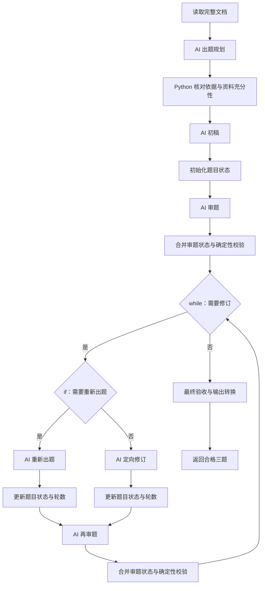

# 文档出题质量与自主修订开发计划

日期：2026-09-20。状态：Q1–Q5 完成；已交付资源、离线闭环、10 次授权真实调用、用户人工评审通过、正式服务页保存及重启恢复。于 2026-09-20 归档。

已完成前置依赖：[节点输入机制与 Python 条件块计划](node-input-and-python-conditions-plan.md) P1–P4 已交付并完成轻量验收；本计划已完成本轮范围。当前已交付的规划、审题及有限修订用法、OCR 限制和验收边界见[实例说明](../../../examples/document-question-generation/README.md)。本计划保留原始目标与实际进展，用户人工评审已明确通过；未触发的真实重出题路径与既有 OCR 限制继续保留。

## 1. 目标与范围

将“完整文档 → 一次出题”扩展为“依据规划 → 初稿 → 独立审题 → 选择修订方式 → 有限循环 → 最终验收”。首轮保持论述题、四选一单选题、填空题各一道及现有顺序，优先验证正确性、单选唯一性、覆盖和可评分性，不扩大题库、批量组卷、RAG、多 Agent 或模型生成流程。

模型在固定契约内输出审题结论，Python 条件块据此决定 if 和 while；模型不得修改次数上限、预算、源码或接线。读取全文与已有 PDF/DOCX/OCR 限制不变，不静默截断、分块或摘要。复杂排版读取失败仍明确失败。

## 2. 质量规则与资源职责

| 环节 | 交付资源 | 明确职责 |
| --- | --- | --- |
| 文档读取 | 现有 read_document.py，适配新入口 | 读取完整资料，保留可用定位信息；不伪造 DOCX 页码 |
| 出题规划 | 新 Prompt 包 | 选择不同知识点、考查目标、难度与原文依据；判断资料是否足够 |
| 初稿 | 升级现有出题包 | 根据资料与规划生成三题，附稳定题目 ID、依据及题型所需答案 |
| 审题 | 新独立 Prompt 包 | 对照原文逐题核验，输出具体问题、依据和处理结论 |
| 定向修订 | 新 Prompt 包 | 根据已记录问题修订指定题目，避免无关改动 |
| 重新出题 | 复用升级后的出题包作为独立节点 | 根本性问题时重新选题；读取规划、当前题目和审核意见 |
| 状态与条件 | Python 通用块及业务契约 | 初始化/更新状态、引用核对、策略条件、轮次递增、最终验收与输出转换 |

资源放在 examples/document-question-generation/，沿用平台三类资源格式；samples 仍只提供各类最小/完整通用模板。包只含声明、契约、Prompt 和可选预算建议，不在块里绕开平台私自调用模型。

审题标准：

- 原文依据：引用确实存在、定位有效，结论没有超出原文；Python 检查存在性，AI 检查语义支持，两者不能互相替代。
- 论述题：题意明确，参考答案回应问题，评分点可依据资料判断。
- 单选题：四个选项互异、恰好一个正确选项，干扰项合理，不用文字提示泄露答案。
- 填空题：四下划线与答案数量一致，空位语义清晰；多种合理表达需要明确接受范围或改题。
- 整组题目：考点不过度重复、难度与目标一致，题目之间不泄露答案。

不以一个总分或模型自信程度作为唯一通过条件；结构合法也不代表业务合格。

## 3. 业务状态与模型决策契约

QuestionState 固定声明资料、规划、当前题目、最新审题意见与已完成修订轮数。以阶段枚举或严格联合约束初始化/完成状态，不使用任意 dict 或大量可空字段掩盖缺失数据。每道题有稳定 ID；问题必须引用实际题目，修订后题型、数量与顺序仍校验。

审题至少包含 verdict、逐题 findings（问题代码、严重性、理由、依据与修订建议）。verdict 仅允许：

| 结论 | 动作 |
| --- | --- |
| pass | 退出修订循环，仍经过最终验收块 |
| revise | 进入定向修订分支 |
| regenerate | 进入重新出题分支 |
| insufficient_source | 停止业务处理并明确失败，不作为成功题目 |

契约检查 pass 不得同时携带未解决的阻断问题；引用 ID 必须有效。确定性校验失败不能被模型 pass 覆盖。模型格式错误由平台契约处理；合法但质量不合格的 findings 才进入业务修订，不把质量意见故意编码成输出格式异常。

所有业务字段名称、阶段类型和错误映射在 Q1 固定，并从权威契约生成 Schema 与示例。INSUFFICIENT_INPUT 保留对象仍表示平台失败；需要通过业务状态表达停止原因时使用正常声明的 verdict，再由终止块明确报错，不混用两种结构。

## 4. 流程与节点输入

图为已实施设计，资料不足、校验失败、取消和预算耗尽等错误边不逐一绘出，均明确终止。

- 原文在长链路中通过高级 references 显式引用读取节点完整输出；规划也引用完整输出，不由模型抄写保留。
- 模型节点 primary 为上一层业务结果；必要 references 由包的固定槽位契约声明。初始化块将出题结果、资料和规划合并为 QuestionState。
- “AI 审题 → 合并状态块”使用简单模式：primary 为审题结果，默认 references[0] 为审题包当次 primary，即完整题目状态。若具体节点入口不符合这个前提，改用明确高级绑定，不猜测来源。
- 两条修订分支分别执行“模型 → 状态更新块”，分支出口均为 QuestionState；状态更新块通过简单参考获取调用前状态，用 Python 增加轮数。循环体再审题并合并完整状态，作为 carry.update。
- while 条件读取当前 carry 的审题结论；if 条件独立接收同份业务主数据，返回严格 bool，分支仍收到完整状态。
- 资料、题目与审题意见必须作为确定性数据保存；AI 不维护轮次或原文副本，不要求复制历史 references。

本轮不增加“挑选历史最佳版本”或独立的候选采纳评分算法。调用前数据仍被保留，可供修订和审计，但循环正常向前执行，不回退执行位置、不撤销外部操作。若后续要求拒绝变差候选并保留最佳版，应单独定义比较契约与采纳规则。

## 5. 终止、重试与预算

默认初稿后最多修订两轮，while.maxIterations=2；AI 可提前 pass，不能提高上限。最终仍为 revise/regenerate 时由平台上限错误终止，不返回未通过题目。insufficient_source 使循环无需继续，但最终验收块必须明确失败；while 停止绝不等于成功。

服务 retryLimit 处理输出契约失败，与两轮业务修订分开。每个模型调用尝试都计入 loop 和实际 token，包括失败与重试；Python 条件检查和循环轮次不等于包调用次数。节点及任务预算遵循平台规则，不能靠业务重置状态绕过。

无格式重试的最长路径为：规划 1 次、初稿 1 次、初次审题 1 次、两轮各“修订/重出题 + 审题”2 次，共 7 次模型调用。若 retryLimit=r，技术重试的调用规划上界按 7×(r+1) 核对（不含连接测试或另加业务节点），分别核算循环内重复节点预算。token 只按供应商实际 usage 记账；不以调用次数或字符数伪装为精确容量、费用估算。

原有 loopLimit=3 和 tokenLimit=131072 不直接沿用。Q3 根据实际 Prompt、文档和所选连接配置新预算，记录最终配置；模型上下文容量与累计任务预算分别说明。主动取消、关闭应用、传输错误和 APPLICATION_INTERRUPTED 沿用现有平台语义。

## 6. 实施步骤

Q1/Q2 已实现，Q3 离线图与正式页面保存通过，Q4 真实调用与用户人工评审完成，Q5 文档更新及清理完成。

| 阶段 | 交付 | 验收条件 |
| --- | --- | --- |
| Q1 契约与业务规则 | 阶段状态、题目与依据、审题决策、Prompt 输入槽位、错误映射 | 严格契约表达数量/题型/问题归属/依据，明确审题标准及最终成功边界 |
| Q2 资源开发 | 规划、初稿、审题、修订包；状态、依据及条件块；资源版本和契约示例 | 可加载全部资源；静态接线通过；两个 if 分支出口与循环 carry 一致 |
| Q3 服务页配置与离线闭环 | 用户通过页面加载、绑定、预算配置、保存实例；说明每个参考槽位和条件 | 局部临时合成响应覆盖路径、错误、计数和终态，不生成长期 setup_service.py 或另一套流程导入协议 |
| Q4 真实模型与人工评审 | 使用自制/授权文档、记录实际连接/实例/预算、题目修订前后对比 | 检查答案正确性、单选唯一性、评分点、覆盖和证据；至少记录实际发生的修订路径，未触发路径另标为离线验证 |
| Q5 交付清理 | 实例手册、需求与导航、真实验收结果和剩余边界 | 临时测试/数据/缓存清理，计划按完成状态归档，保留业务资源与使用手册 |

## 7. 验收清单与真实模型边界

- [x] 原文、规划和当前题目在多轮中保持可用，模型输出不能覆盖原文。
- [x] 首次 pass 不修订；revise 与 regenerate 分别走正确分支；每轮基于最新完整状态。
- [x] 持续不合格达到上限明确失败；资料不足、非法 verdict、错误引用与契约失败均不能伪装成功。
- [x] 现有三题顺序、单选选项、填空和非空校验继续生效；引用存在性与语义支持分别检查。
- [x] 修订、审题、技术重试计数正确；预算、取消和应用退出的任务终态及记录正确。
- [x] 真实文档比较当前一次出题基线与新流程：使用相同文档和评分标准，记录发现的问题、是否修好、是否引入新错误、实际调用和 token，不预先承诺提升比例。
- [x] 审题可独立绑定模型连接；同一模型的独立调用可作为首版配置，但模型互审不能替代人工核验。
- [x] 本地 OCR 未完成项继续保留，不能把读取成功等同于复杂排版或业务质量验收通过。

2026-09-20 本次实施期间用户明确解除此前线上调用限制，指定使用现有 ds 环境，所有真实模型调用合计不得超过 10 次。实际连接、每次调用与 token、修订前后对比保存在 artifact 验收证据与当前验收记录中。真实模型互审不替代人工评审，用户随后明确回复“人工评审通过”，本轮业务质量目标完成。

结束开发时删除对应临时测试、测试数据、缓存和自动组装服务脚本；不删业务资源或使用手册。仅在目标真实完成后将计划移入 docs/archive/完成日期/；若提前由手册接替，手册必须继续明确真实模型与人工验收未完成事项。

- [x] 独立人工评审最终题目及评分标准：用户明确回复“人工评审通过”。
- [x] 按用户授权通过实际 Electron 服务页完成资源加载、接线、ds 绑定与新实例保存，重启恢复及预检通过。

## 8. 本次实施记录

- Q1：权威契约为 examples/document-question-generation/quality_contracts.py；固定题目 ID、证据行范围与原文引句、规划充分性联合、待审/已审联合状态、审题枚举及错误映射。生成源码副本及公开 Schema，合成示例由权威模型验证。
- Q2：新增规划/审题/修订包，出题包升至 3.0.0，新增九个质量块。读取块仍为 2.0.0，算法未变。所有资源使用 NodeInput，未往平台核心加入业务分支。
- 接线细化：初稿和重新出题前增加 prepare_generation 显式转换块，统一为 GenerationInput；重新出题后通过简单参考取得该输入中的原状态。两个分支均输出完整 QuestionState。
- Q3：四包/九块加载及完整 if/while 接线通过；离线执行 pass、revise、regenerate、混合两轮、上限、资料不足、非法引用/ID、矛盾 pass、生产包格式重试及 loop/token、取消/退出/中断边界。samples 保持通用 2.0.0 模板，补充最新流程及版本边界说明。
- Q4：现有 ds/deepseek-flash；自制十二行 DOCX 全文读取；相同资料执行旧基线和新流程。实际发现填空接受范围重复单位被审题降为 advisory 的问题，补强既定审题规则后，真实模型走 revise → 修改指定题目 → 再审 pass。该路径没有人为植入错题；重新出题路径目前仅离线验证。
- 真实调用在临时内存验收实例完成，用户明确回复人工评审通过。随后通过实际 Electron 页面保存新服务“文档出题质量 · ds”，serviceId=svc_e8c711863f8a4e54a197f60d2b55913d，instanceId=ins_3f8bd5e24179402c92bb3244f4e8cdaa，版本 1.0；重启恢复及预检通过，没有额外模型调用。Q5 清理完成，计划归档。

最终实际调用共 10 次，供应商 usage 为输入 22013、输出 18726、合计 40739 token。完整结果、基线对比、边界和人工评审入口见[验收记录](../2026-09-21/document-question-quality-validation.md)。上述协议勾选项包含离线验证，实际模型重出题路径未触发，不能据此宣称该路径已做真实验收。
