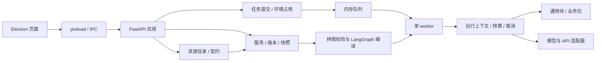

# V1 精简与架构评估

评估日期：2026-09-17。依据是当前源码依赖与调用链；用户已确认最小产品验证完成。本轮没有重新调用真实模型。

后续变更：同日按用户新要求清空并重建 samples，原查重代码、生成器和流程导入/调用脚本已删除。本文下方的样例保留决策记录的是此前清理阶段，当前模板以 [三类资源索引](../samples/README.md) 为准；平台架构评估仍可参考。

## 清理结论

项目确实存在旧入口和多余代码。新版已通过 FlowDraft 保存与执行，但仍保留旧实例加载 API、旧清单/配置校验、旧快照构造和顺序执行器。它们不在现用桌面拼图链路中，继续保留会形成两套开发约定。

| 清理对象 | 处理 | 依据与影响 |
| --- | --- | --- |
| `/api/v1/registry/load`、loadDefinition IPC | 删除；统一使用 catalog/load | 旧接口加载手写 instance.json，新服务只接受 `{name, flow}`；旧调用方须迁移 |
| registry/api、definitions、目录式 blocks，旧实例/块清单模型与 configuration | 删除 | 仅支撑旧入口；仍需的 schema_shape 移到公共校验模块 |
| InstanceSnapshot / prepare_snapshot / SequentialExecutor | 删除旧实现，保留 SnapshotRepository | 新实例使用 FlowSnapshot 和 compile_flow；无须双轨执行 |
| RunContext 中被 FlowRunContext 替代的能力绑定与调用 | 删除旧方法，保留公共步骤记录/包调用 | 模型/API/块能力从节点配置解析 |
| ServiceManager 的 definitions/packages/blocks 依赖 | 移除 | 保存只依赖当前目录与环境；预算直接引用 draft，移除 definition 兼容别名 |
| 查重 instance/ | 权威算法/契约迁到 source/，删除旧入口和状态模型 | 清洗与计分仍参与现用块生成，不能当废代码删除 |
| 查重生成器中的第二份清洗算法 | 从 source/preprocessing.py 生成 | 清洗行为只维护一份权威逻辑；分发块保持单文件 |
| checks/、desktop/checks/ | 删除 | 用户要求移除当前测试脚本和替身 |
| examples/、查重 examples/ | 迁移必要教学块/协议说明后删除旧测试数据与示例入口 | 批量验收文本、人工模拟报告、旧手写实例不再保留 |
| invoke_similarity.py 默认测试输入 | 改为必须指定 --input | 真实接入显式提供业务数据 |
| check:window 脚本、record_task.py | 删除 | 对应测试已移除；旧任务回填工具仅支持 I1，不再适用 |
| 桌面 control.schema.json 中的旧错误契约 | 从当前权威模型重新生成 | 补齐现用拼图错误字段，避免后端启动错误被误判为协议错误 |

保留 `samples/` 的教学配方、短输入和可复制模块，因为它们是指导样例；保留生成契约副本、分发块和桌面协议 Schema，因为它们被产品实际加载。`--check` 是生成一致性检查，不是保留旧测试套件。保留模型连接诊断，这是用户使用中的必要功能。

`artifact/` 原样保留；依赖目录与锁文件不做清理。历史任务及交付记录保留为只读参考并标注过时入口，不作为当前运行指南。旧代码可从 Git 历史追溯，本轮没有提交或重写历史。

## 当前架构与扩展性

支持继续扩展。资源目录、契约、拼图、运行时、适配器和仓储已有职责划分；查重业务位于 samples；稳定服务与固定任务快照分离。增加新块/包/业务配方不需要修改核心业务分支；新适配器可沿模型能力接口扩展。

这些边界还不等于可独立部署服务：

- create_app 直接组装内存仓储和单 worker，队列是 asyncio.Queue，锁和环境占用都是进程内状态。
- FlowSnapshot 持有已编译图、类型适配器和 Python 对象，不能把它当作跨进程任务消息传输。
- 版本签名和快照构造直接读取 ModuleCatalog 内部集合，仓储尚无统一接口。
- 同步 Python 块在执行协程中调用，长计算可能阻塞同一事件循环；现有 await 边界无法抢占正在执行的同步块。
- 会话资源、历史和任务没有容量限制与回收策略；大型输入/报告会增加内存占用。
- renderer/index.js、flow-editor.js 集中承担较多页面与表单逻辑，未来修改易相互影响。

## 是否提前拆服务

**目前不拆服务，继续模块化单体。** 当前是单机桌面会话、可信本地代码、单任务串行执行；拆成多个部署服务会先引入队列持久化、共享占用锁、快照分发、凭据传输和退出协调，尚不能带来已经证明的收益。也不能简单增加 Uvicorn workers，否则服务、目录和任务记录会分散到各进程。

下一步可按需求在同一进程内拆清接口：

| 模块边界 | 合适时机与动作 | 保持的规则 |
| --- | --- | --- |
| API 路由与应用组装 | 增加新页面/API 时，把资源/服务/环境/运行路由按域分文件 | 不改变现有路径和错误契约 |
| 仓储与服务管理 | R3 持久化前明确 save/get/history/activate/occupy 等接口 | 原子版本切换、环境占用、固定快照 |
| 快照与目录 | R2 导入导出前提供公开的快照投影接口 | 源码字节+摘要+依赖+编译器版本可重建，禁止只传本地路径 |
| 调度与执行 | R4 并发前定义任务认领/终态/取消接口 | loop/token 累计与错误优先级不变 |
| 前端编辑器 | R1 扩充表单时按资源、接线、节点配置、控制容器拆模块 | 保持同一草稿状态来源，错误定位稳定 |

需要拆分的明确触发条件：

1. CPU 密集或不受信任的块需要强隔离：先把执行移到受控子进程；定义超时终止和快照加载，随后再考虑独立 worker 服务。
2. 多用户共享/多机执行或串行队列无法满足经测量的等待要求：先完成持久化、共享队列、任务租约和凭据引用，再拆控制 API 与执行 worker。
3. 模型出口出现独立限流、凭据治理或伸缩需求：才评估独立模型网关，当前保留适配器层。

拆服务前还须明确任务交付语义与重复执行处理、版本快照序列化、取消消息、worker 异常后的任务状态和统一可观测性。当前不新增这些基础设施，仅将其作为启动拆分工作的前置条件。

## 验证边界

删除脚本前使用已有定向检查验证了精简后的 worker：纯块、模型成功、循环、预算不足、取消、断连、超时、非法输出、退出及环境释放；查重检查覆盖 0/0.5/1 计分与语义失败不发布部分成功结果，使用本地协议替身。脚本随后按要求移除。

最终检查已通过：全部现存 Python 导入/语法、11 个 JavaScript 文件语法、顺序/分支/repeat/while 执行、HTTP 保存/历史/回退、双包与查重配方预检编译、生成文件一致性、文档本地文件链接和 Git 差异格式。桌面校验器接受真实后端模型生成的启动错误，拒绝错误协议版本。共移除 90 个测试脚本；artifact 中 22 个文件逐一 SHA-256 比较一致。未安装依赖、打包或发布；未重新做真实模型验收或完整桌面交互验收。
